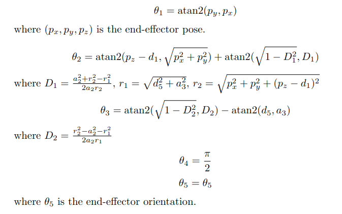

# VLM Benchmarks on the Koch v1.1 Manipulator
## Introduction
This repository aims to reproduce the results of recent publications that use vision-language models (VLMs) for robot manipulation tasks on low-cost DIY manipulators. The goal is to create a centralized hub for VLM-based manipulator projects, enabling rapid testing and benchmarking. I chose the [Koch v1.1](https://github.com/jess-moss/koch-v1-1) manipulator to start, due to its compatibility with [lerobot](https://github.com/huggingface/lerobot).

Note: The koch v1-1 has only 5DoF, which may be limiting for more complex experiments. For future projects, I would recommend a low-cost 6DoF robot (ex. [Simple Automation](https://docs.google.com/spreadsheets/d/1i-t-i7dLayyafxtfTy8_VctcmbbnCp6Mays1JUR9Qg4/edit?gid=47726668#gid=47726668)).

## Koch v1.1 Manipulator
Please follow the build instructions found on the [original repository](https://github.com/jess-moss/koch-v1-1?tab=readme-ov-file#assembly-instructions).

To simplify the forward and inverse kinematics, I set θ₄=π/2. This is good enough to achieve most pick-and-place tasks.

### DH Table
| Joint | a (Link Length) | α (Twist) | d (Offset) | θ (Joint Angle) | Joint Limits (rad) |
|-------|----------------|-----------|------------|----------------|---------------------|
| 1     | 0             | -π/2      | d_1 = 5.5        | θ₁            | [-π/2, π/2]        |
| 2     | a_2 = 10.68         | 0         | 0          | θ₂            | [0, π/2]           |
| 3     | a_3 = 10           | 0         | 0          | θ₃            | [-π/2, π/2]        |
| 4     | 0             | π/2       | 0          | π/2            | [-π/2, π/2]        |
| 5     | 0             | 0         | d_5 = 10.5       | θ₅            | [-π, π]            |

### Inverse Kinematics

## Sample Demos
### [ReKep](https://rekep-robot.github.io/)

#### Experiment 1: Eraser into Tape
https://github.com/user-attachments/assets/99434062-c455-40b1-b682-657e4cad514d

#### Experiment 2: Chess
https://github.com/user-attachments/assets/3496987d-d6bc-4b77-9a39-7f86e06efc25

#### Experiment 3: Block Stacking
https://github.com/user-attachments/assets/f0b55d51-8e67-4500-9fd6-8f15c189fb1c

